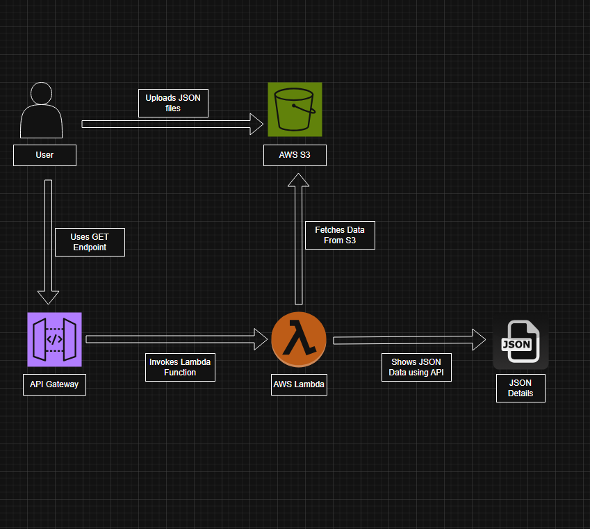

# Serverless Account Balance API using AWS

This project demonstrates a **serverless API built on AWS** that retrieves account balance information stored in **Amazon S3**. The API is exposed using **Amazon API Gateway** and processed by **AWS Lambda**. The infrastructure is deployed using **AWS CloudFormation**.

---

# Architecture

## Architecture

<p align="center">
  
</p>

Client → API Gateway → AWS Lambda → Amazon S3 → JSON File → Response

### Flow
1. The client sends a request to the API endpoint.
2. API Gateway receives the request.
3. API Gateway invokes the Lambda function.
4. Lambda reads the `accountNumber` query parameter.
5. Lambda fetches the corresponding JSON file from S3.
6. The JSON content is returned as the API response.

---

# AWS Services Used

- **AWS CloudFormation** – Deploy infrastructure
- **Amazon API Gateway** – Create REST API
- **AWS Lambda** – Process API requests
- **Amazon S3** – Store account data in JSON format
- **AWS IAM** – Permissions for Lambda to access S3

---

# API Endpoint

```
GET /balancestatus01?accountNumber={accountNumber}
```

Example request:

```
GET /balancestatus01?accountNumber=56789
```

Example response:

```json
{
  "name": "John Doe",
  "accountNumber": 56789,
  "balanceStatus": 22000
}
```

---

# Deployment Steps

### 1. Deploy CloudFormation Stack

1. Open **AWS Console**
2. Navigate to **CloudFormation**
3. Click **Create Stack**
4. Upload the file `BalanceApp.yaml`
5. Enter required parameters:

Example:

```
BucketNameParameter: your-unique-bucket-name
LambdaRoleNameParameter: lambda-s3-role
LambdaRuntimeParameter: python3.12
RESTAPINameParameter: AccountBalanceAPI
APIStageParameter: Prod
```

6. Click **Create Stack**

CloudFormation will create the following resources:

- S3 Bucket
- IAM Role
- Lambda Function
- API Gateway
- API Deployment

---

# Demo Instructions

### Step 1 — Upload Sample Data to S3

Upload a JSON file to the S3 bucket created by the stack.

Example file name:

```
56789.json
```

Example content:

```json
{
  "name": "John Doe",
  "accountNumber": 56789,
  "balanceStatus": 22000
}
```

---

### Step 2 — Get API Endpoint

Go to:

```
API Gateway → Stages → Prod
```

Copy the **Invoke URL**

Example:

```
https://your-api-id.execute-api.region.amazonaws.com/Prod
```

---

### Step 3 — Test the API

Use this format:

```
https://your-api-id.execute-api.region.amazonaws.com/Prod/balancestatus01?accountNumber=56789
```

You can test it using:

- Browser
- Postman

---

# Example Request Flow

```
Client Request
      ↓
API Gateway
      ↓
Lambda Function
      ↓
S3 Bucket
      ↓
56789.json
      ↓
Return JSON Response
```

---

# Key Features

- Fully serverless architecture
- Infrastructure deployed using CloudFormation
- Dynamic data retrieval using query parameters
- Uses AWS managed services

---


# Author
Extra JSON files are added for the User to test.
